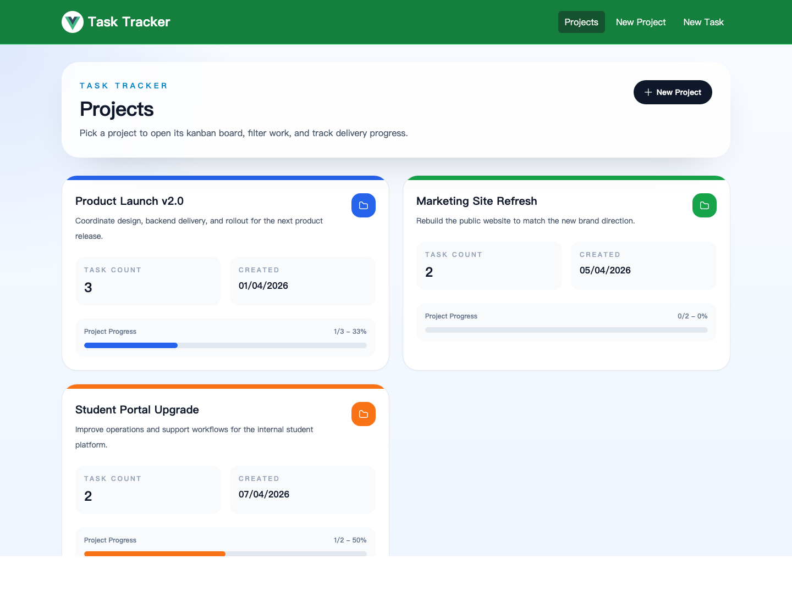
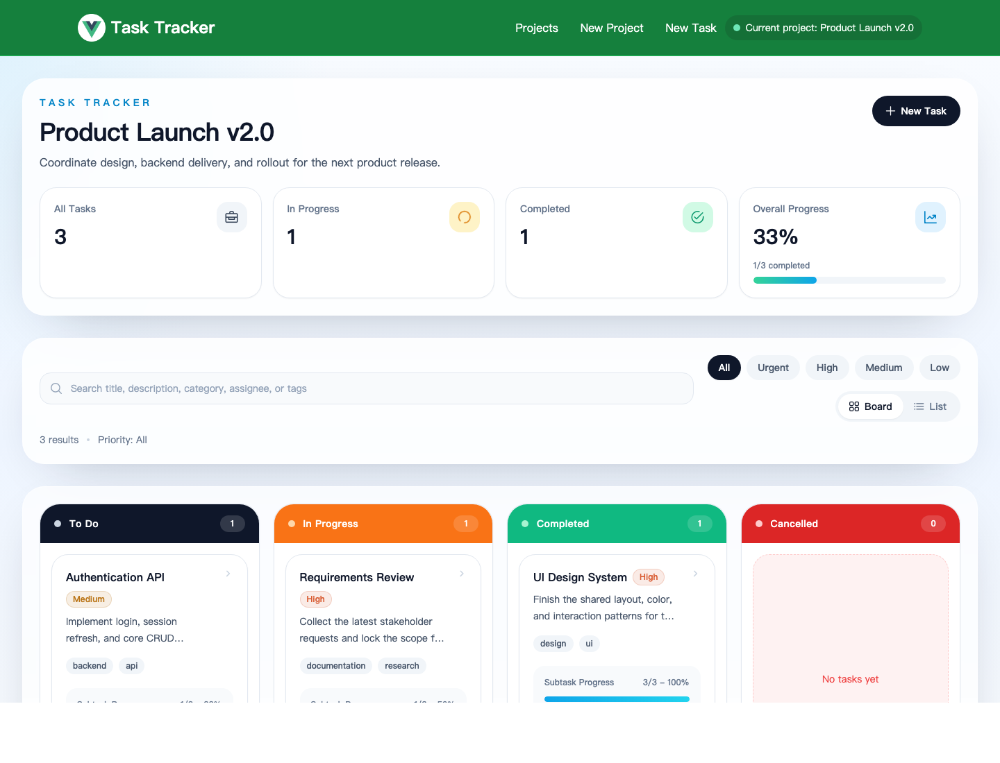
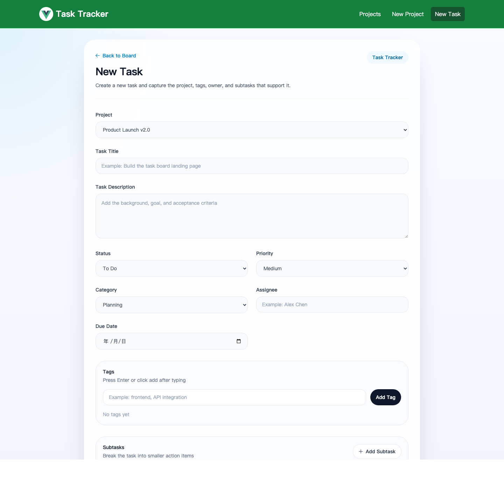
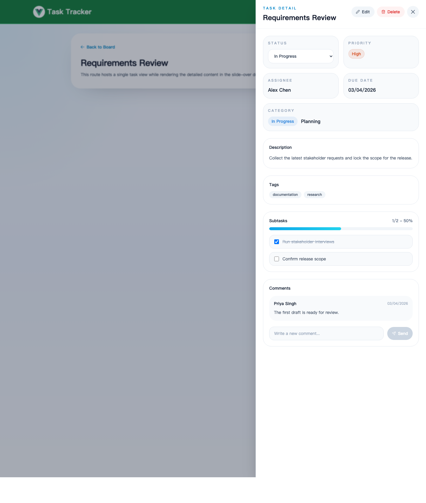

# Task Tracker: Learn Vue 3 by Building a Kanban App

This repository is meant to be read like a tutorial, not just a project handoff.
If you work through this README from top to bottom, you should be able to:

- understand what the app does
- understand why Vue 3 is a good fit for this kind of interface
- learn the role of Vite, Vue Router, Pinia, and JSON Server in the stack
- run the project locally
- find your way around the codebase without guessing
- make small changes with confidence

The demo application is a task tracker with projects, kanban columns, drag and drop status changes, editable task details, subtasks, comments, and summary stats.

## Table of Contents

1. [What You Will Learn](#what-you-will-learn)
2. [Why This Project Is a Good Vue Tutorial](#why-this-project-is-a-good-vue-tutorial)
3. [Tech Stack](#tech-stack)
4. [What the Finished App Does](#what-the-finished-app-does)
5. [Screenshots](#screenshots)
6. [Quick Start: Run the Project First](#quick-start-run-the-project-first)
7. [How the App Is Structured](#how-the-app-is-structured)
8. [Step 1: How Vue Boots the App](#step-1-how-vue-boots-the-app)
9. [Step 2: How Routing Works](#step-2-how-routing-works)
10. [Step 3: How State Management Works with Pinia](#step-3-how-state-management-works-with-pinia)
11. [Step 4: How the Mock Backend Works](#step-4-how-the-mock-backend-works)
12. [Step 5: How Forms Work in Vue](#step-5-how-forms-work-in-vue)
13. [Step 6: How the Kanban Board Works](#step-6-how-the-kanban-board-works)
14. [Step 7: How Task Details, Comments, and Subtasks Work](#step-7-how-task-details-comments-and-subtasks-work)
15. [Project Structure Walkthrough](#project-structure-walkthrough)
16. [Common User Flows to Try](#common-user-flows-to-try)
17. [Vue vs React: What to Notice](#vue-vs-react-what-to-notice)
18. [Testing and Build Commands](#testing-and-build-commands)
19. [Troubleshooting](#troubleshooting)
20. [Ideas for Extensions](#ideas-for-extensions)

## What You Will Learn

By the end of this tutorial, you should understand these core Vue ideas:

- how a Vue 3 app is created and mounted
- how single-file components keep template, logic, and styling close together
- how `ref`, `reactive`, `computed`, `watch`, and `onMounted` are used in a real app
- how `v-model`, `v-if`, and `v-for` replace common React patterns
- how Vue Router turns a single-page app into multiple views
- how Pinia stores shared app state and business logic
- how a frontend can talk to a simple backend API
- how drag and drop interactions can update application state cleanly

## Why This Project Is a Good Vue Tutorial

This app is a strong learning example because it covers both basic and intermediate Vue patterns in one place.

- It has multiple pages, so you can see routing clearly.
- It has shared state, so Pinia is genuinely useful instead of forced.
- It has forms, which makes `v-model` and Vue's template syntax easy to appreciate.
- It has derived state, which makes `computed()` meaningful.
- It has async API calls, loading states, and error states.
- It has an interaction-heavy view, the kanban board, that shows how Vue components coordinate with each other.

In other words, this is not just a static demo. It is a small but realistic Vue application.

## Tech Stack

| Technology | Why it is used here |
| --- | --- |
| Vue 3 | Core UI framework |
| Vite | Fast development server and build tool |
| Pinia | Global state management for projects and tasks |
| Vue Router | Navigation between project list, board, and task screens |
| Tailwind CSS | Utility-first styling |
| Axios | API requests to the mock backend |
| JSON Server | Lightweight local backend for `projects` and `tasks` |
| vuedraggable | Drag and drop between kanban columns |
| vue-toastification | Success and error notifications |
| Vitest | Unit testing for the stores |

## What the Finished App Does

Once the project is running, you can:

- browse all projects from the home page
- open a project board
- filter tasks by keyword and priority
- switch between a board view and a table view
- drag tasks between statuses
- create projects and tasks
- edit task details
- add comments to a task
- track subtask completion
- see live summary statistics

## Screenshots

These screenshots show the four main views you will work with while reading the tutorial.

### 1. Project List

The home page gives you a high-level view of each project, including progress, task count, and the entry point into the kanban board.



### 2. Project Board

The board view combines project-level stats, local filtering, and drag-and-drop task movement across status columns.



### 3. New Task Form

The task form demonstrates Vue's form handling patterns with `v-model`, reusable inputs, and dynamic tag and subtask sections.



### 4. Task Detail Drawer

The detail drawer shows how routing, shared state, and inline updates come together for status changes, comments, and subtask tracking.



## Quick Start: Run the Project First

If you want to learn by doing, start here.

### Prerequisites

- Node.js 18 or later
- npm

You can verify your setup with:

```bash
node --version
npm --version
```

### 1. Install dependencies

From the project root:

```bash
npm install
```

### 2. Start the mock backend

In terminal 1:

```bash
npm run server
```

This starts JSON Server on:

- `http://localhost:8000`

The data comes from:

- `src/tasks.json`

Useful endpoints:

- `http://localhost:8000/projects`
- `http://localhost:8000/tasks`

### 3. Start the Vue app

In terminal 2:

```bash
npm run dev
```

This starts Vite on:

- `http://localhost:3000`

Open that URL in your browser.

### Optional: Start everything with one command

If you want the fastest clean start for a demo, use:

```bash
npm run dev:full
```

That command:

- resets `src/tasks.json` back to the seed data
- starts JSON Server on `http://localhost:8000`
- starts Vite on `http://localhost:3000`

### Reset the demo data manually

If you changed tasks or projects while recording or testing, you can restore the original dataset with:

```bash
npm run reset-data
```

### 4. If port `8000` is already in use

Run JSON Server on a different port:

```bash
npx json-server --watch src/tasks.json --port 8001
```

Then point the frontend at that backend:

```bash
VITE_API_BASE_URL=http://127.0.0.1:8001 npm run dev
```

That works because the Axios client uses an environment variable when it is provided:

```js
const client = axios.create({
  baseURL: import.meta.env.VITE_API_BASE_URL || 'http://localhost:8000',
});
```

## How the App Is Structured

At a high level, the app looks like this:

```text
Browser
  -> Vue UI
     -> Pinia stores
        -> Axios API layer
           -> JSON Server
              -> src/tasks.json
```

The key idea is separation of responsibility:

- Vue components render the interface.
- Pinia stores manage shared state and app actions.
- API modules keep HTTP logic out of components.
- JSON Server gives the frontend a realistic backend to talk to.

## Step 1: How Vue Boots the App

The app entry point is `src/main.js`.

Its job is to:

- import global CSS
- create the Vue app
- register Pinia
- register Vue Router
- register toast notifications
- mount the app into `index.html`

The root component is `src/App.vue`, and it is intentionally simple:

```vue
<script setup>
import Navbar from '@/components/Navbar.vue';
import { RouterView } from 'vue-router';
</script>

<template>
  <Navbar />
  <RouterView />
</template>
```

This is a useful Vue pattern to notice:

- the navbar is always visible
- the current page is swapped in through `<RouterView />`

If you know React, this feels similar to a shared layout component that renders `{children}` plus a router outlet.

## Step 2: How Routing Works

Routes are defined in `src/router/index.js`.

```js
const router = createRouter({
  history: createWebHistory(import.meta.env.BASE_URL),
  routes: [
    { path: '/', name: 'home', component: () => import('@/views/ProjectListView.vue') },
    { path: '/projects/add', name: 'add-project', component: () => import('@/views/AddProjectView.vue') },
    { path: '/projects/:id', name: 'project-board', component: () => import('@/views/HomeView.vue') },
    { path: '/tasks/add', name: 'add-task', component: () => import('@/views/AddTaskView.vue') },
    { path: '/tasks/:id', name: 'task-detail', component: () => import('@/views/TaskDetailView.vue') },
    { path: '/tasks/:id/edit', name: 'edit-task', component: () => import('@/views/EditTaskView.vue') },
  ],
});
```

What each route does:

- `/` shows the project list
- `/projects/add` shows the new project form
- `/projects/:id` shows a single project's task board
- `/tasks/add` shows the new task form
- `/tasks/:id` hosts the task detail drawer route
- `/tasks/:id/edit` shows the task edit form

Important Vue Router concepts used in this project:

- `RouterLink` for navigation in templates
- `useRoute()` to read route params and query params
- `useRouter()` to navigate programmatically after form submission

## Step 3: How State Management Works with Pinia

This project uses two stores:

- `src/stores/projectStore.js`
- `src/stores/taskStore.js`

Pinia stores are built around three ideas:

- `state`: reactive shared data
- `getters`: derived data
- `actions`: business logic and async operations

Here is the shape of the task store:

```js
export const useTaskStore = defineStore('taskStore', {
  state: () => ({
    tasks: [],
    isLoading: false,
    error: null,
  }),
  getters: {
    filteredTasks: (state) => (search = '', priority = '') => {
      // search and priority filtering
    },
  },
  actions: {
    async fetchTasks() { /* load tasks from API */ },
    async addTask(task) { /* create task through API */ },
    async updateTask(id, data) { /* update existing task */ },
    async removeTask(id) { /* delete task */ },
    async changeStatus(id, status) { /* kanban status change logic */ },
  },
});
```

This store is one of the most important files in the repository because it holds real business logic, not just data.

### A good example: `changeStatus`

When a task is moved on the board:

- the task status changes
- subtasks can also be updated automatically

This project intentionally adds a little business logic:

- if a task is moved to `completed`, unfinished subtasks are marked done
- if a task is moved back to `todo`, completed subtasks are reset to incomplete

That makes the board behavior feel more realistic and shows that a store can do more than just pass API responses through.

### Why Pinia works well here

Pinia is a good fit because:

- multiple views need the same task and project data
- the board, forms, stats, and detail drawer all depend on shared state
- centralizing API actions reduces duplication inside components

## Step 4: How the Mock Backend Works

The app does not talk to a real database-backed server. Instead, it uses JSON Server.

The source of truth is:

- `src/tasks.json`

That file contains two collections:

- `projects`
- `tasks`

JSON Server turns those collections into REST endpoints automatically.

Examples:

- `GET /projects`
- `POST /projects`
- `GET /tasks`
- `POST /tasks`
- `PUT /tasks/:id`
- `DELETE /tasks/:id`

The frontend calls those endpoints through small API wrapper modules:

- `src/api/projects.js`
- `src/api/tasks.js`
- `src/api/client.js`

This separation is useful because components and stores do not need to know Axios details. They only call functions such as `getAllTasks()` or `createProject()`.

## Step 5: How Forms Work in Vue

The best file to study here is:

- `src/components/TaskForm.vue`

This file shows several classic Vue form patterns:

- `v-model` for two-way binding
- reactive form state with `reactive()`
- dynamic lists for tags and subtasks
- conditional rendering
- clean submit handling with `@submit.prevent`

Example:

```vue
<input
  v-model="form.title"
  required
  placeholder="Example: Build the task board landing page"
  type="text"
/>
```

In React, this would usually require:

- a `value`
- an `onChange`
- a state setter

Vue is shorter here because `v-model` handles that binding directly.

The task form also demonstrates reusable component design:

- the same component is used for both creating and editing a task
- `initialData` is passed in when editing
- `isEdit` changes the button label
- the submit event emits a clean payload upward

The project form follows the same idea in:

- `src/components/ProjectForm.vue`

## Step 6: How the Kanban Board Works

The main board view lives in:

- `src/views/HomeView.vue`

This view is where several Vue concepts meet:

- route params identify the current project
- Pinia provides the project and task data
- `computed()` derives filtered and grouped tasks
- `KanbanColumn.vue` renders each status column
- `TaskDetailDrawer.vue` opens when a task is selected

### Filtering and grouping

`HomeView.vue` computes:

- the current project
- tasks for that project
- filtered tasks based on keyword and priority
- tasks grouped by status for each column

This is exactly the kind of problem `computed()` is great at: turning raw state into UI-ready state.

### Drag and drop

`src/components/KanbanColumn.vue` uses `vuedraggable`.

When a card is dropped into a different column:

- the component detects the task id
- it detects the target column status
- it emits a `task-moved` event

Then `HomeView.vue` handles that event by calling the Pinia store action:

- `taskStore.changeStatus(taskId, newStatus)`

That is a good architectural pattern:

- the component handles interaction details
- the store handles state and business logic

## Step 7: How Task Details, Comments, and Subtasks Work

The detail system is split into two files:

- `src/views/TaskDetailView.vue`
- `src/components/TaskDetailDrawer.vue`

Why split it this way?

- the route gives each task its own URL
- the drawer gives the UI a modern side-panel feel

The drawer lets users:

- inspect task metadata
- change task status
- toggle subtasks
- add comments
- open the edit screen
- delete the task

This part of the app is useful to study because it combines:

- route-driven state
- store updates
- local component state for new comments
- optimistic-feeling interactions with immediate feedback

## Project Structure Walkthrough

Use this section when you want to know where to look next.

```text
.
|-- README.md
|-- COMPARISON.md
|-- index.html
|-- package.json
|-- vite.config.js
`-- src/
    |-- App.vue
    |-- main.js
    |-- tasks.json
    |-- api/
    |   |-- client.js
    |   |-- projects.js
    |   `-- tasks.js
    |-- assets/
    |   `-- main.css
    |-- components/
    |   |-- KanbanColumn.vue
    |   |-- Navbar.vue
    |   |-- ProjectCard.vue
    |   |-- ProjectForm.vue
    |   |-- StatsBar.vue
    |   |-- TaskCard.vue
    |   |-- TaskDetailDrawer.vue
    |   `-- TaskForm.vue
    |-- router/
    |   `-- index.js
    |-- stores/
    |   |-- projectStore.js
    |   |-- taskStore.js
    |   `-- __tests__/
    `-- views/
        |-- AddProjectView.vue
        |-- AddTaskView.vue
        |-- EditTaskView.vue
        |-- HomeView.vue
        |-- NotFoundView.vue
        |-- ProjectListView.vue
        `-- TaskDetailView.vue
```

### Recommended reading order

If you are new to the codebase, read files in this order:

1. `src/main.js`
2. `src/App.vue`
3. `src/router/index.js`
4. `src/stores/projectStore.js`
5. `src/stores/taskStore.js`
6. `src/views/ProjectListView.vue`
7. `src/views/HomeView.vue`
8. `src/components/TaskForm.vue`
9. `src/components/TaskDetailDrawer.vue`
10. `src/tasks.json`

That order moves from framework setup to routing to state to the main user flows.

## Common User Flows to Try

Once the project is running, try these in order:

### Flow 1: Browse projects

- open `http://localhost:3000`
- inspect the project cards on the home page
- click a project to open its board

### Flow 2: Create a project

- click `New Project`
- fill in the name, description, and color
- submit the form
- confirm that the app redirects to the new board

### Flow 3: Create a task

- from a project board, click `New Task`
- choose the project
- add title, description, status, priority, assignee, due date, tags, and subtasks
- submit the form

### Flow 4: Drag a card

- move a task from `To Do` to `In Progress` or `Completed`
- watch the board update
- open the task and inspect the changed status

### Flow 5: Edit details

- open a task
- change its status
- toggle subtasks
- add a comment
- open the edit page and update the fields

These flows are useful because they exercise nearly every important part of the stack.

## Vue vs React: What to Notice

If you already know React, here are the main comparisons worth noticing in this codebase:

- `ref()` and `reactive()` fill roles similar to `useState()`
- `computed()` often replaces `useMemo()` for derived state
- `onMounted()` often plays the role of a simple `useEffect()`
- `v-model` replaces the common `value + onChange` pattern
- `v-if` and `v-for` replace conditional JSX and `.map()`
- Pinia feels more structured than passing state down manually, but lighter than Redux Toolkit for a project this size
- Vue Router and React Router solve the same problem, but Vue's template syntax often reads more directly in markup-heavy UIs

For a longer side-by-side comparison, see:

- `COMPARISON.md`

## Testing and Build Commands

This project includes store tests and a production build step.

Run tests:

```bash
npm run test
```

Create a production build:

```bash
npm run build
```

Preview the built app locally:

```bash
npm run preview
```

The tests currently focus on the Pinia stores. They cover things such as:

- initial state
- creating and removing tasks
- updating tasks
- task filtering
- stats calculation
- form payload shaping and task-detail navigation flows

## Troubleshooting

### The page loads but no data appears

Check that JSON Server is running on `http://localhost:8000`.

You can test it directly:

```bash
curl http://localhost:8000/tasks
```

### Port `8000` is already busy

Use a different backend port:

```bash
npx json-server --watch src/tasks.json --port 8001
VITE_API_BASE_URL=http://127.0.0.1:8001 npm run dev
```

### Port `3000` is already busy

Vite will usually offer another port automatically, or you can specify one:

```bash
npm run dev -- --port 3001
```

### I changed `src/tasks.json`, but the UI did not update

Make sure:

- JSON Server is still running
- you saved the file
- you are editing valid JSON

### Drag and drop feels different on touch devices

That is expected. The board uses fallback drag behavior for coarse pointers and touch input so that the interaction remains usable on more devices.

## Ideas for Extensions

If you want to keep learning after this tutorial, here are good next steps:

- replace JSON Server with a real backend such as Express or FastAPI
- add authentication
- add due-date sorting and server-side search
- persist user preferences such as selected board view
- split stores into smaller modules as the app grows
- add component-level tests for the board and forms
- deploy the frontend and backend separately

## Final Takeaway

This project demonstrates a very practical Vue 3 workflow:

- Vite for fast development
- Vue Router for navigation
- Pinia for shared state
- JSON Server for a simple local API
- reusable components for forms and views

If you can run this project, read the files in the recommended order, and trace one user flow from UI event to store action to API call, you already understand the core structure of a real Vue single-page application.
